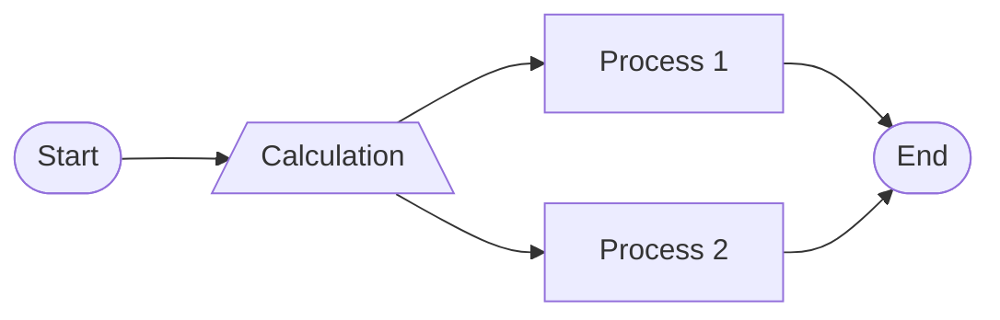
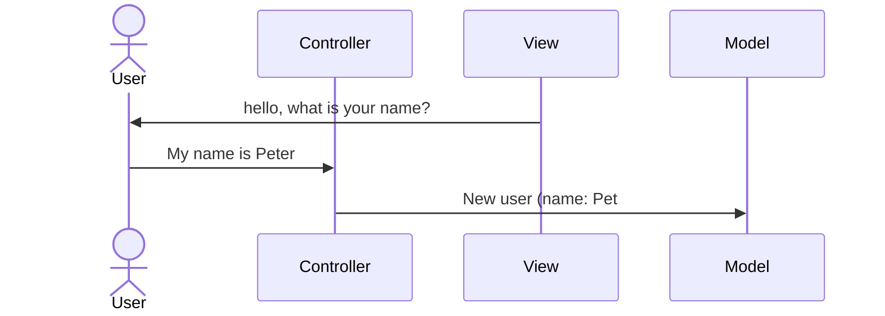

## Brainstorming / design

 - generation
 - grid contains cells
 - rule

A flow chart:

```mermaid
flowchart LR

	C[/Calculation\]
	P1[Process 1]
	P2[Process 2]
	E([End])
	S([Start])

	S-->C
	C-->P1-->E
	C-->P2-->E
	
```

A sequence diagram:

```mermaid
sequenceDiagram

	actor U as User
	participant C as Controller
	participant V as View
	participant M as Model

	V->>U: hello, what is your name?
	U->>C: My name is Peter
	C->>M: New user (name: Pet
```