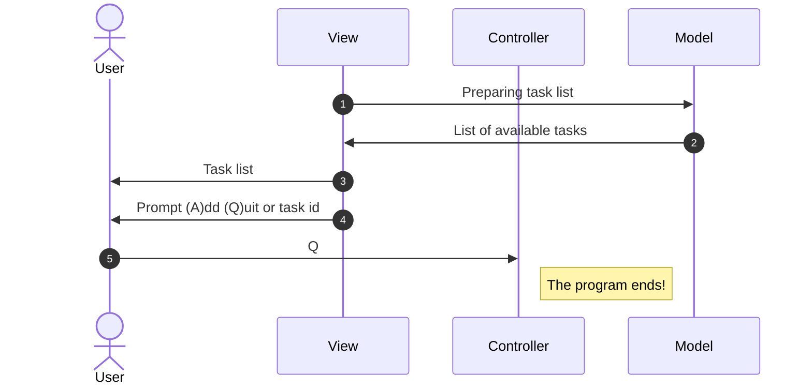
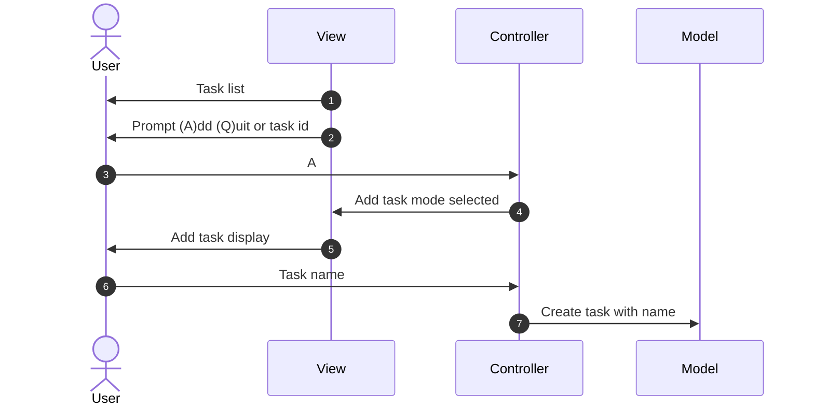
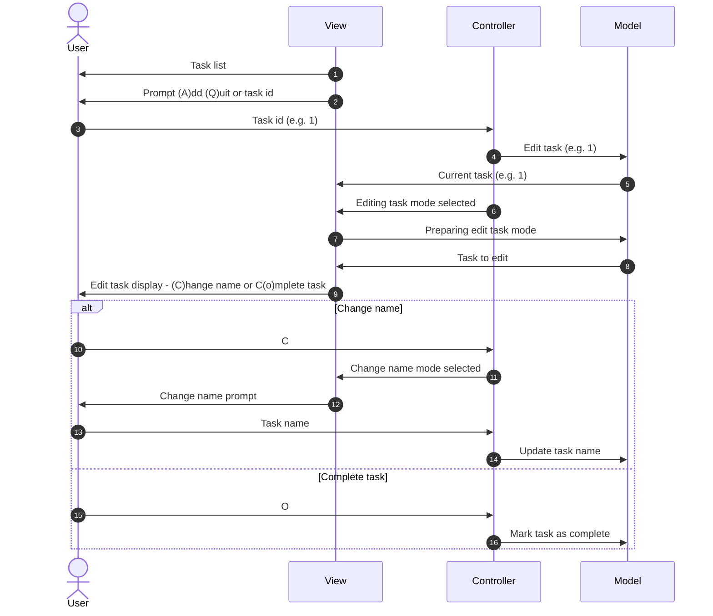

# Instructions

In this kata we practise separating input, output and modelling concerns.

The goal is to produce a task list program which can be driven from the command line. There is no need to persist the task list to a database or file (though you could try that later).

## How this kata works
On the `main` branch, the README specifies the kata requirements. You can also see a suggested design.

There's also a starting point for the first user journey - tests and implementation.

You can try to do the second user journey starting from this point. To see how it progresses, checkout the following branches:

```
main (main menu)
  |
  \_ task-list/moq/step-2 (add a task)
       |
       \__ task-list/moq/step-3 (edit a task)
            |
             \__ task-list/moq/step-4 (refactoring)
```

## Requirements

1. Show the task list on the screen.
	- Each task has a corresponding number (task id)
	- Task ids stay attached to their task for the duration of the program (no changing / reusing numbers)
	- Only incomplete tasks are shown
1. Display a command prompt and wait for input
	- The command prompt should display an option to (A)dd task or (Q)uit
1. If you choose to quit, the program immediately exits
1. When adding a task, you are prompted for the name of the task. It is then immediately added to the task list
1. The command prompt will also accept the task id which switches to task editing mode
	- you can change the name of the task
	- you can mark the task as complete

## Suggested design

To keep the program cleanly factored, we suggest a design like this:
1. An object to manage the display of a task list and command prompt on screen (the "View")
1. An object to accept user input, validate it and either execute the action or generate a message about what went wrong. 
Note that this class should not write output itself. That's the job of the View object. (the "Controller")
1. A set of objects to represent the task list in memory. These should be capable of responding to the actions the controller wants to execute. (the "Model")

N.B. This is similar to the Smalltalk MVC model, but is quite different to e.g. ASP.Net MVC

### Journeys
Here's a suggested list of user journeys split across different objects. It might help to test-drive these one at a time.

#### Show the task list, then quit



#### Add a task

#### Edit a task journey

